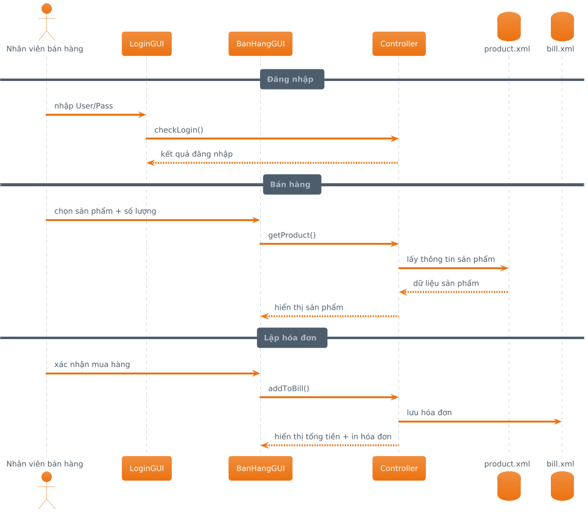
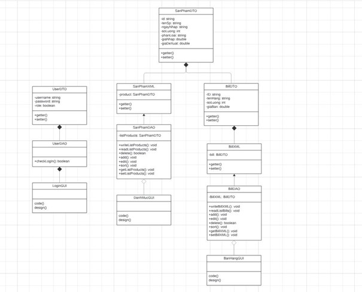

# Quản Lý Bán Hàng Siêu Thị
## 👨‍💻 Nhóm thực hiện
- **Chu Việt Long** - 22010107  
- **Hà Tiến Quang** - 22010136  
- **Đỗ Thanh Hải** - 21011122  

---

## 📌 Giới thiệu
Đây là bài tập lớn môn **Lập trình Hướng Đối Tượng (OOP)** của nhóm sinh viên CNTT, Đại học Phenikaa.  
Ứng dụng được xây dựng nhằm hỗ trợ siêu thị trong việc quản lý sản phẩm, bán hàng và thống kê doanh thu.  
Hệ thống được phát triển bằng **Java (Swing, OOP, MVC)** và sử dụng **XML** để lưu trữ dữ liệu.

---
## UML Sequence Diagram

## UML Class Diagram

## ✨ Chức năng chính
- **Quản lý sản phẩm**
  - Thêm, sửa, xóa, tìm kiếm, sắp xếp (theo ID, tên, số lượng, giá).
- **Quản lý bán hàng**
  - Tạo hóa đơn, thêm/xóa mặt hàng, tính tổng tiền, in hóa đơn.
- **Thống kê**
  - Tổng số sản phẩm nhập.
  - Tổng tiền nhập.
  - Tổng số lượng bán.
  - Tổng doanh thu và lợi nhuận.

---

## 🛠 Công nghệ sử dụng
- **Ngôn ngữ lập trình:** Java (OOP)
- **Giao diện:** Java Swing
- **Kiến trúc phần mềm:** MVC (Model - View - Controller)
- **Cơ sở dữ liệu:** XML (`product.xml`, `bill.xml`)

---

## ⚙️ Cài đặt và chạy chương trình
1. Cài đặt **JDK 8+** và **NetBeans / IntelliJ / Eclipse**.
2. Clone hoặc tải về mã nguồn dự án.
3. Import dự án vào IDE.
4. Chạy file `Main.java` để khởi động ứng dụng.

---

## 🚀 Hướng dẫn sử dụng
1. **Đăng nhập**  
   - Tài khoản mặc định:
     - `admin / admin`
2. **Menu chính** gồm:
   - Sản phẩm
   - Hóa đơn
   - Thống kê
   - Đăng xuất
3. **Thao tác quản lý**:
   - Thêm, sửa, xóa, tìm kiếm và sắp xếp sản phẩm.
   - Tạo hóa đơn bán hàng, tính tổng tiền và in hóa đơn.
   - Xem thống kê doanh thu, lợi nhuận.

---

## 📖 Tài liệu tham khảo
- [Chuyển đổi giữa CSDL quan hệ và XML – ĐHQG Hà Nội, PGS.TS. Đỗ Trung Tuấn (2011)]  
- [Tìm hiểu về XML](https://topdev.vn/blog/xml-la-gi/)  
- [Mô hình MVC là gì?](https://vietnix.vn/tim-hieu-mo-hinh-mvc-la-gi/)  
